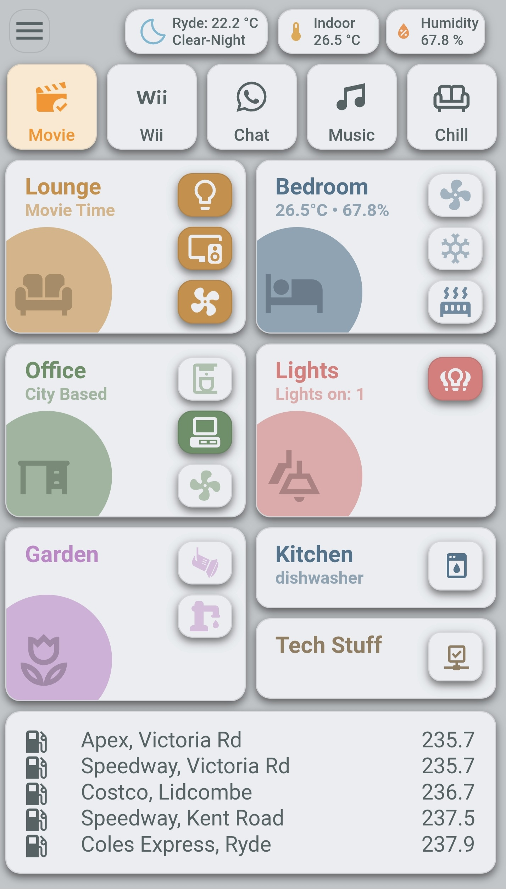
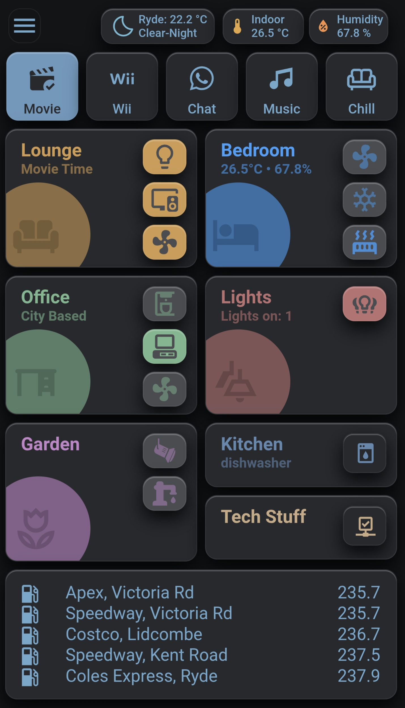

# Home Assistant Configuration

This repository contains my personal configuration for Home Assistant, focused on a clean, room-based dashboard and modular YAML structure.

**Version:** v1.0 (Initial public release)

---

## 🖥️ Dashboard Screenshots
  Light Theme             |  Dark Theme
:-------------------------:|:-------------------------:
  |  

---


## 🧭 Overview

* **Platform:** Home Assistant
* **Dashboard Mode:** YAML (modular, Git-managed)
* **Design Approach:** Room-centric cards (not multi-page navigation)
* **Automation:** Primarily Node-Red (json flows added)

* **Goal:** Maintainable, version-controlled smart home setup

---

## 🧱 Structure

```text
/config
  /dashboards
    ui-lovelace.yaml
  /node_red
    node_red_all_flows.json
    + json flows for each area/room 
  /themes
    dark_theme.yaml
    light_theme.yaml
  configuration.yaml
  customize.yaml
  template.yaml
  automations.yaml
  scripts.yaml
  secrets_example.yaml
  scenes.yaml
  google_calendars.example.yaml
```

---

## 🔐 Sensitive Data

Sensitive information is **not included** in this repository.

* `secrets.yaml` is excluded via `.gitignore`
* `google-calendars.yaml` is excluded via `.gitignore`
* Template files are provided:

  * `secrets_example.yaml`
  * `google_calendars.example.yaml`

If you reuse this config, create your own `secrets.yaml`/`google_calendars.yaml` and populate them with your values.

---

## ⚠️ Excluded Files & Folders

The following are intentionally not tracked:

* `.storage/` (Home Assistant internal state)
* `*.db`, logs, backups
* `secrets.yaml`
* `www/` (custom assets such as icons/images)
* `blueprints/` (unused in my instance)
* `custom_*/` (custom components and templates)

* `zigbee2mqtt/`, `esphome/`, and other local integrations

### Notes

* Some UI elements (icons, images) may be missing if they rely on files in `/www/`
* Replace with your own assets or standard MDI icons where needed

---

## 🧩 Custom Cards & Dependencies

This setup uses custom Lovelace cards (via HACS), such as:

* `button-card`
* `card-mod`
* `decluttering-card`
* `bubble-card`
* `Kiosk Mode`


Ensure required resources are installed and available in your Home Assistant instance.

---

## 🚀 Usage

This repository is intended as:

* A personal backup
* A reference for dashboard design and YAML structuring
* A starting point for others building modular Home Assistant dashboards

---

## 📌 Disclaimer

This configuration is tailored to my environment and devices.
It may require modification to work in your setup.

---

## 📷 Screenshots

Screenshots are stored in the `/screenshots` directory and referenced using relative paths.

---

## 🔄 Future Improvements

* Add detail on how my instance is configured (HAOS/Zigbee etc)
* Further modularisation of dashboard components
* Dashboards are to be split into **modular card files** for easier maintenance and cleaner Git diffs.
* Each room or section is defined independently and included in the main dashboard.
    /cards 
      lounge.yaml
      bedroom.yaml
      office.yaml
      lights.yaml
      garden.yaml
      kitchen.yaml
      tech.yaml
      fuel.yaml
* Template standardisation for reusable card styles
* Optional Git-based deployment workflow
* Complete a kitchen popup card for white-good automation
* and no doubt many more tweaks and updates as my journey evolves.

## 🛠️ Getting Started

---

1. Copy files into your Home Assistant `/config` directory
2. Create `secrets.yaml` based on `secrets_example.yaml`
3. Install required custom cards via HACS
4. Restart Home Assistant

---
